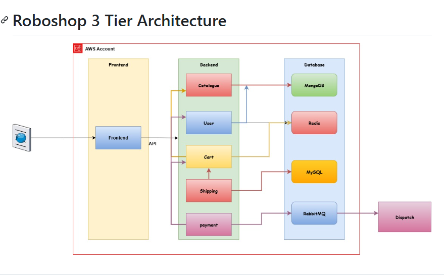

# shell-roboshop-common
Deploying services using Shell Script

### Architecture

### Solution

#### Databases

- Mongo DB
- Redis
- MySql
- RabbitMq

#### Backend

- Catalogue (NodeJs)
- User (NodeJs)
- Cart (NodeJs)
- Shipping (Java)
- Payment (Python)

#### Frontend

- Html (using nginx)

